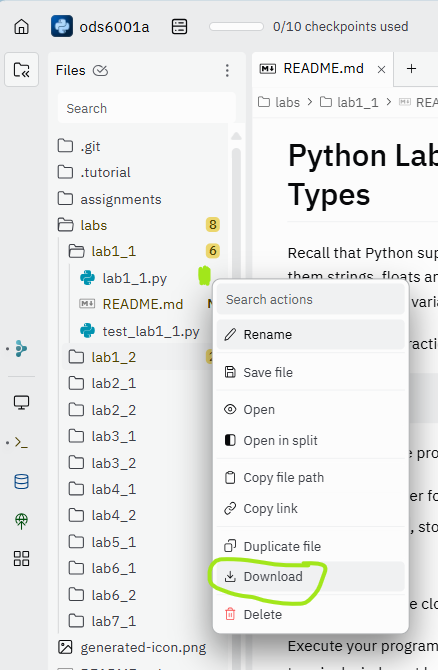

# Python Lab 1.1: Variables and Types

Recall that Python supports multiple "data types" among them strings, floats and integers. Is important to note that the data type of a variable matters!

Consider the program in `lab1_1.py` in the text editor at top-right. At first glance, it looks like it

1. prompts the user for two inputs, `x` and `y`,
2. adds `x` and `y`, storing the sum in `z`, and
3. prints `z`.

But let's look more closely.

Execute your program by typing: `python lab1_1.py` in the terminal window at bottom-right, followed by Enter. 
- When prompted for `x`, input `1`, followed by Enter. 
- When prompted for `y`, again input `1`, followed by Enter.

How curious!
- Python thinks that 1+1=11




### Not what you expected!
Contrary to what this program thinks, 1 plus 1 does not equal 11! The sum should, of course, equal 2.

Modify `lab1_1.py` in the text editor at top-right in such a way that the program correctly outputs the sum of `x` and `y`.



Try to convert your x and y inputs into a numeric data type.



If you need extra help ...


  Consider using the float function, so your program can add floating point numbers as well as integers!





If you want extra help... here is the solution:


 ```
  z = float(x) + float(y)
 ```


### Execute your program 

Provide the value 1 for x, and 1 for y

Remember in order to execute your code you type in the terminal:
```
python lab1_1.py
```
Make sure that the output is 2.0!



### Check Your Code

Execute the below to evaluate the correctness of your code using `check50`, but be sure to test it yourself before that...

```
check50 mkotsovoulou/ods6001a/main/labs/lab1_1
```

Execute the below to evaluate the style of your code using `style50`.

```
style50 lab1_1.py
```



## Submit your code

Execute the command below, logging in with your `GitHub username` and `Personal Access Token` when prompted. For security, you'll see asterisks (`*`) instead of the actual characters in your token. 

If you do not have generated a Personal Access ToKen follow the instructions: 
https://docs.github.com/en/authentication/keeping-your-account-and-data-secure/creating-a-personal-access-token

```
submit50 mkotsovoulou/ods6001a/main/labs/lab1_1
```

You can re-submit your solution as many times as you want.
When you are happy with your solution, download the code and upload it to Canvas.




# Done!
:tada: